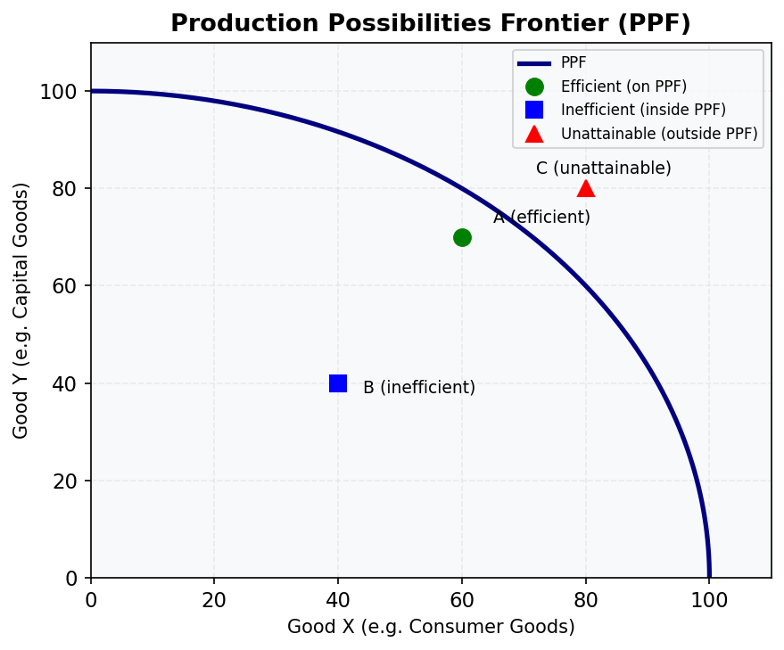
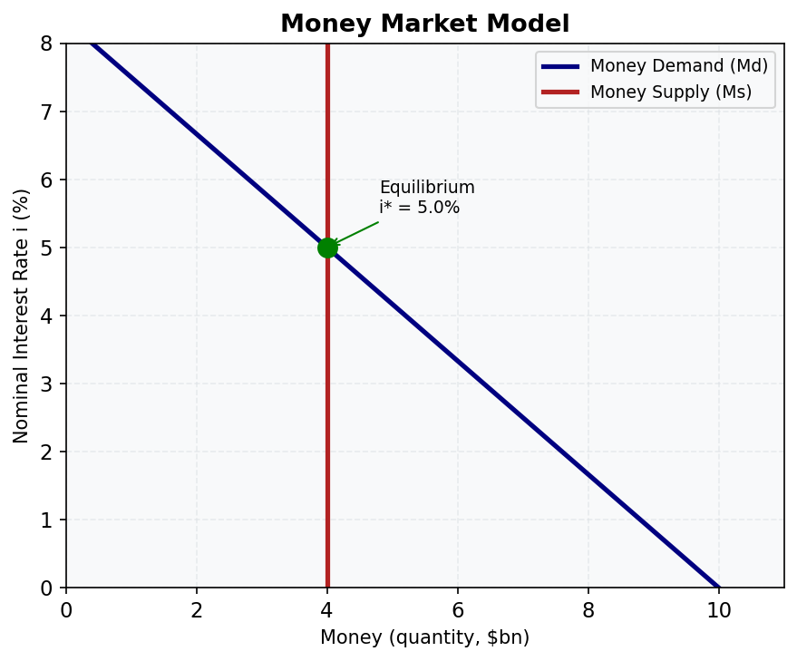
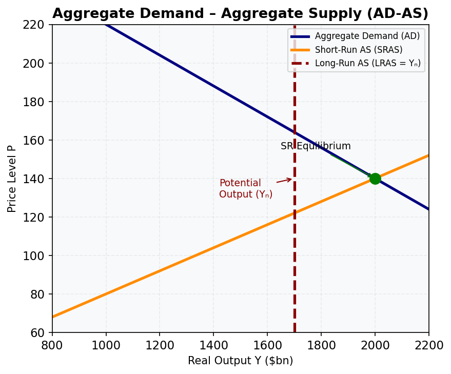
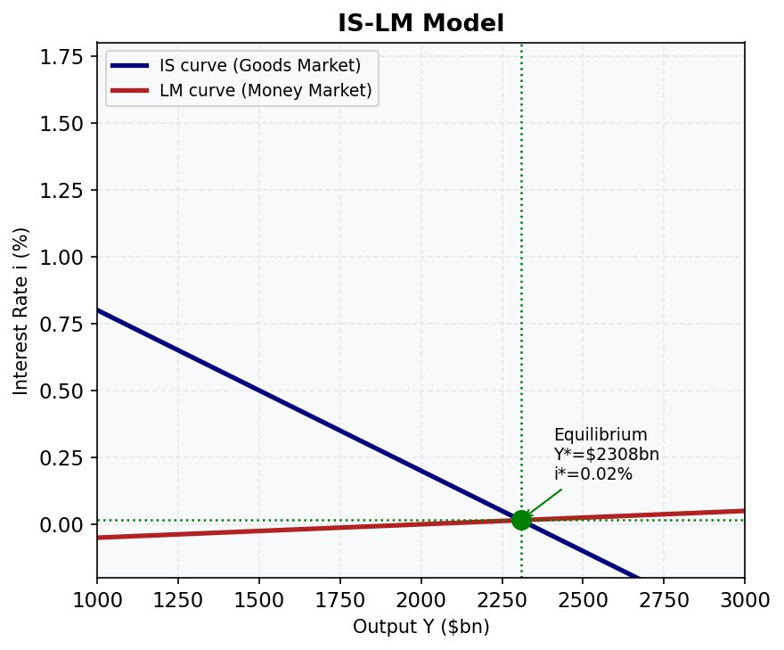
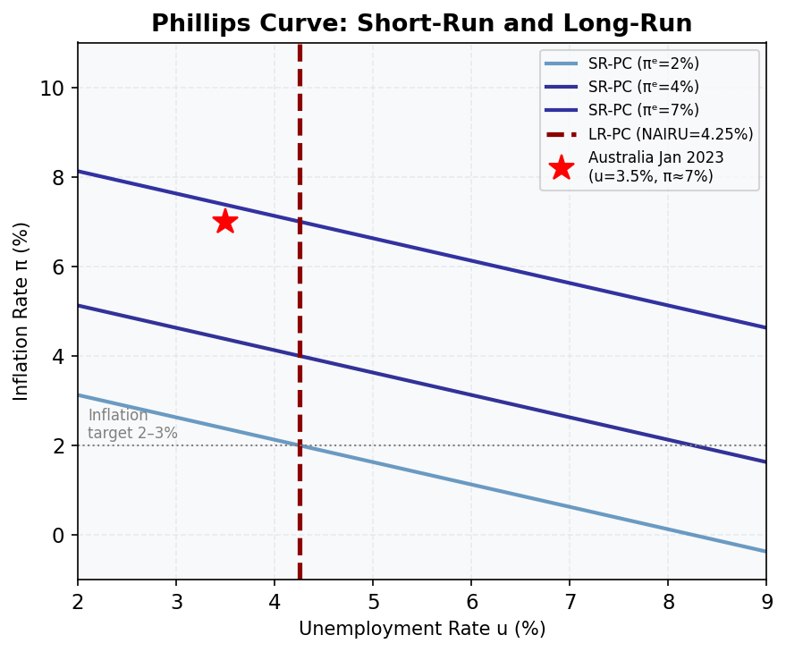
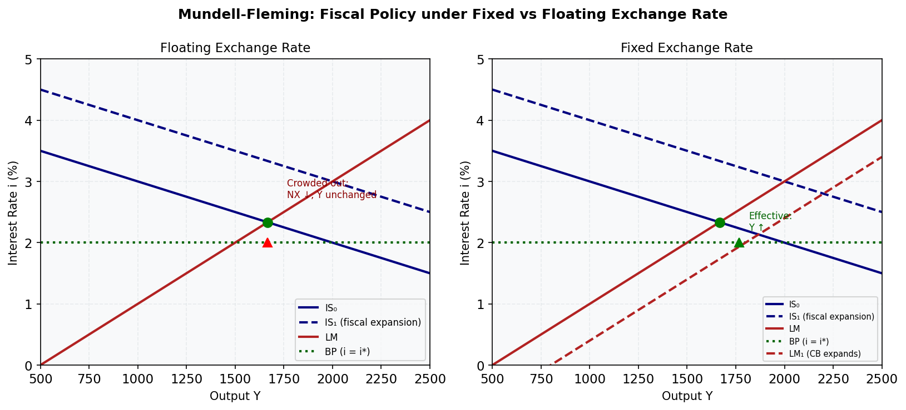

# 📊 Key Diagrams

*Core macroeconomics diagrams for quick reference and revision*

---

## 1. Production Possibilities Frontier (PPF)

The PPF shows the maximum combinations of two goods an economy can produce given its resources and technology.

- **On the curve** — efficient (all resources fully employed)
- **Inside the curve** — inefficient (idle resources or poor technology)
- **Outside the curve** — currently unattainable
- **The slope** measures the opportunity cost of producing one more unit of Good X

*Relevant lessons: M01, M03*

---

## 2. Keynesian Cross

Equilibrium output Y\* is where planned expenditure (PE) crosses the 45° line (PE = Y).

- **Slope of PE line** = MPC − import propensity (b − m)
- **Multiplier** = 1/(1 − b + m)
- Gaps above/below equilibrium cause inventory adjustment until Y\* is reached

*Relevant lessons: M04, M13*

---

## 3. Money Market Model

The equilibrium interest rate is set where money demand (downward sloping) meets money supply (vertical — controlled by the RBA).

- **RBA increases Ms** → curve shifts right → interest rate falls
- **Income rises** → Md shifts right → interest rate rises

*Relevant lessons: M05, M06, M14*

---

## 4. Aggregate Demand – Aggregate Supply (AD-AS)

The AD-AS model determines the price level and output in the short and long run.

- **AD** slopes down (wealth effect, interest rate effect, exchange rate effect)
- **SRAS** slopes up (sticky wages and prices in the short run)
- **LRAS** is vertical at potential output Y_n
- **Long-run equilibrium** requires AD = SRAS = LRAS

*Relevant lessons: M07*

---

## 5. IS-LM Model

Simultaneous equilibrium in goods markets (IS) and money markets (LM).

- **IS** slopes down: higher i → lower I → lower Y
- **LM** slopes up: higher Y → higher money demand → higher i
- **Australia calibration**: Y\* ≈ $2,308bn, i\* ≈ 1.54% (post-GFC baseline)
- **Fiscal expansion** → IS shifts right (with crowding out)
- **Monetary expansion** → LM shifts right

*Relevant lessons: M14, M15*

---

## 6. Phillips Curve (Short-Run and Long-Run)

The trade-off between inflation and unemployment.

- **Short-run PC** slopes down: lower u → higher π (at given expectations)
- **Long-run PC** is vertical at the NAIRU (~4.25% for Australia)
- **SR-PC shifts up** when inflation expectations rise (or supply shocks hit)
- **Australia Jan 2023**: u = 3.5% (below NAIRU), π ≈ 7% (well above target)

*Relevant lessons: M16, M17*

---

## 7. Solow Growth Model

The steady-state capital stock k\* is where saving per worker equals break-even investment.

- **sf(k)**: saving per worker (concave — diminishing returns)
- **(δ+n+g)k**: break-even investment (replacement + new workers + technology)
- **Australia**: s = 0.25, α = 0.35, δ+n+g = 0.08 → k\* ≈ 5.77, y\* ≈ 1.85
- **Golden rule**: s_GR = α = 0.35 → Australia saves too little (s = 0.25 < 0.35)

*Relevant lessons: M18*

---

## 8. Mundell-Fleming Model

Policy effectiveness in an open economy depends on the exchange rate regime.

| | Floating | Fixed |
|---|---|---|
| **Fiscal policy** | Ineffective (crowded out via AUD appreciation) | Effective |
| **Monetary policy** | Effective | Ineffective |

- **Australia** (floating + free capital): monetary policy works; fiscal policy has limited multiplier
- The **impossible trilemma**: cannot simultaneously have free capital mobility, fixed exchange rate, and independent monetary policy

*Relevant lessons: M20, M21*
