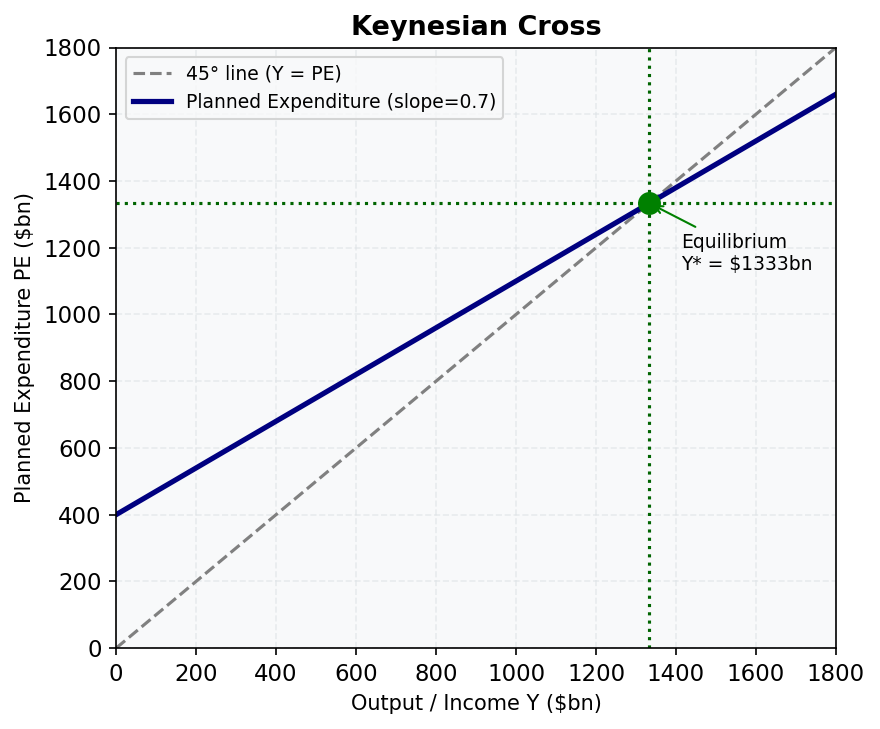

# Lesson M04.L01: Keynesian Economics: Core Assumptions and Historical Context

**Module:** Macroeconomics in the Short-Run: The Basic Keynesian Model
**Level:** intro
**Duration:** 30 minutes
**Learning Objective:** Summarise the historical context of Keynesian economics (Great Depression); identify core assumptions: sticky prices, demand-driven output in the short run.
**Data as of:** 2024
**Provenance:** [OpenStax Macro 3e](https://socialsci.libretexts.org/Bookshelves/Economics/Macroeconomics/Principles_of_Macroeconomics_3e_(OpenStax)) | [MIT OCW 14.02](https://ocw.mit.edu/courses/14-02-principles-of-macroeconomics-spring-2023)

## Explanation

!!! info "Key Diagram"
      
    *Figure 2: The Keynesian Cross. Equilibrium output Y* is where planned expenditure (PE) crosses the 45° line.*

**Keynesian economics** is a school of macroeconomic thought developed by British economist John Maynard Keynes in the 1930s, chiefly in his 1936 work *The General Theory of Employment, Interest and Money*. It emerged as a direct response to the **Great Depression** (1929–1939), the most severe economic contraction in modern history.

**The Great Depression in context:**
- US unemployment reached 25% by 1933; Australia's hit approximately 30% at its peak
- Real GDP in the US fell roughly 30% between 1929 and 1933
- The prevailing "classical" economic view held that markets would self-correct: wages and prices would fall until equilibrium was restored. Keynes observed this was not happening — the economy was stuck.

**Keynes's challenge to classical economics:**
Classical economists assumed prices and wages adjust flexibly and quickly, so markets always clear. Keynes argued this assumption fails in the *short run*:

1. **Sticky prices:** Prices (especially wages) do not adjust instantly downward. Workers resist wage cuts; firms fear losing customers if they cut prices. This means markets can remain out of equilibrium for extended periods.

2. **Demand-driven output in the short run:** Because prices don't quickly adjust, output is determined primarily by the *level of spending* (aggregate demand). If households, firms, and governments spend less, output falls and unemployment rises — even if prices theoretically "should" adjust.

3. **Role of government:** Because markets can fail to self-correct quickly, Keynes argued governments should actively manage aggregate demand — increasing spending or cutting taxes during downturns to restore full employment.

The Keynesian framework dominated economic policy in most advanced economies from the 1940s through the 1970s, and experienced a significant revival during the 2008–09 Global Financial Crisis and the 2020 COVID-19 pandemic, when Australia and other governments deployed large stimulus packages.

## Worked Example

**The Great Depression Mechanism (simplified):**

**Step 1 — Initial shock (1929):**
US stock market crashes. Household wealth falls sharply. Consumer confidence collapses.

**Step 2 — Demand falls:**
Households cut spending dramatically. Firms face falling sales, so they cut production and lay off workers.

**Step 3 — Classical prescription:**
Classical theory: wages should fall, making labour cheaper; firms rehire; equilibrium restores.

**Actual outcome:** Wages are sticky downward. Workers and unions resist cuts. Firms also resist price cuts fearing competitive disadvantage. The economy stays stuck at high unemployment.

**Step 4 — Keynes's diagnosis:**
The economy is trapped in an **underemployment equilibrium** — a stable situation where output and employment are below full capacity. Without an external injection of spending, the market will not self-correct quickly.

**Step 5 — The Keynesian solution:**
Government steps in as "spender of last resort." Australia's Scullin and later Curtin governments, and later the 1940s post-war reconstruction, demonstrated that public spending could restore employment. The US New Deal (1933–38) under Roosevelt was the archetypal Keynesian response.

**Australia comparison:** Australia's recovery from the Depression accelerated with wartime government spending in the early 1940s — real GDP grew rapidly once the government injected large spending, consistent with Keynesian predictions.

## Common Misconception

**Misconception:** Keynesian economics argues that government spending is *always* better than private spending and that markets never work.

**Correction:** Keynes was not anti-market. His argument was specifically about the *short run* when prices are sticky and aggregate demand has collapsed. He explicitly acknowledged that in the *long run*, classical market adjustment mechanisms operate. His famous quip was: "In the long run we are all dead" — meaning that waiting for the long-run self-correction is not an acceptable policy response when people are unemployed and suffering now. Modern Keynesian models blend short-run demand management with long-run supply-side considerations.

## Practice Prompts

1. Why did the Great Depression challenge classical economic theory, which predicted that recessions would be short-lived?
   → **Answer:** Classical theory assumed wages and prices would fall quickly during a recession, restoring market equilibrium and employment. In the Depression, wages and prices proved to be **sticky downward** — they did not fall fast enough to clear markets. Unemployment persisted at 25–30% for years, demonstrating that real economies can remain well below full employment for extended periods without automatic self-correction.

2. What are the two core assumptions that distinguish Keynesian from classical macroeconomics?
   → **Answer:** (1) **Sticky prices** — prices and wages do not adjust quickly in the short run, so markets do not instantly clear. (2) **Demand-driven output** — in the short run, the level of output and employment is determined by aggregate demand (total spending), not by supply-side factors alone.

3. How did Australia's economic policy response to the 2020 COVID recession reflect Keynesian principles?
   → **Answer:** The Australian government deployed large demand-side interventions: the JobKeeper wage subsidy (~$90 billion), enhanced JobSeeker payments, and cash grants to businesses. These were designed to support aggregate demand — keeping households spending and firms operating — consistent with Keynes's prescription of government injecting spending when private demand collapses. The policy worked: Australia's 2020 recession was short (two quarters) compared to the Depression's decade-long contraction.

## Further Resources
- 📺 **[Fiscal Policy and Stimulus: Crash Course Economics #8](https://www.youtube.com/watch?v=otmgFQHbaDo)** — Crash Course (12 min)
- 📺 **[Macroeconomics: Crash Course Economics #5](https://www.youtube.com/watch?v=d8uTB5XorBw)** — Crash Course (12 min)
- 📚 **[RBA — Fiscal Policy Explainer](https://www.rba.gov.au/education/resources/explainers/fiscal-policy.html)** — RBA overview of Keynesian fiscal policy principles and their application in Australia
