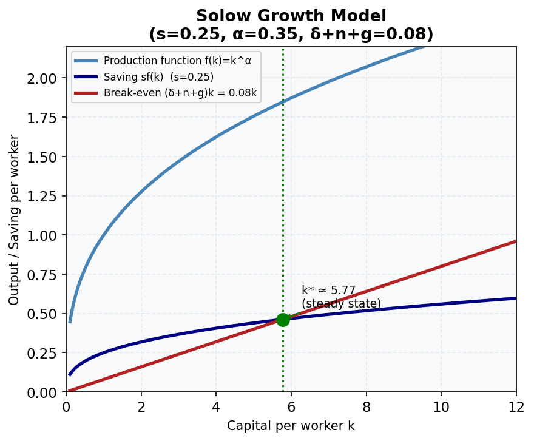

# Lesson M18.L01: Stylised Facts of Economic Growth: Kaldor's Facts

**Module:** Economic Growth Part I
**Level:** intermediate
**Duration:** 30 minutes
**Learning Objective:** Evaluate Kaldor's six stylised facts of economic growth against Australian and Asia-Pacific data.
**Data as of:** 2024
**Provenance:** [ABS National Accounts](https://www.abs.gov.au/statistics/economy/national-accounts/australian-national-accounts-national-income-expenditure-and-product) | [World Bank Open Data](https://data.worldbank.org)

## Explanation

!!! info "Key Diagram"
      
    *Figure 7: The Solow Growth Model. The steady-state k* occurs where the saving curve sf(k) intersects the break-even line (δ+n+g)k. Australia: s=0.25, α=0.35, δ+n+g=0.08 → k*≈5.77.*


Before building formal growth models, economists identify *stylised facts* — robust empirical regularities that hold approximately across many countries and time periods. Nicholas Kaldor (1961) articulated six such facts. A valid growth model should be consistent with all of them.

**Notation:**
- Y = real GDP; L = labour; K = capital; Y/L = output per worker; K/L = capital per worker
- K/Y = capital-output ratio; r = rate of return on capital (real)
- w_K = capital income share; w_L = labour income share
- g_x = growth rate of variable x

**Kaldor's Six Stylised Facts:**

1. **Output per worker grows at a roughly constant rate over time.**  
   *Australia:* Real GDP per capita has grown at approximately 1.5–2.0% p.a. over the post-war period (ABS National Accounts). This growth is sustained, not a one-off catch-up.

2. **Capital per worker grows at a roughly constant rate over time.**  
   Capital deepening (K/L rising) has been persistent in Australia. The mining investment boom of 2004–2013 accelerated this temporarily.

3. **The capital-output ratio (K/Y) is roughly constant over time.**  
   Since both K and Y grow at similar rates, K/Y is stable. *Caveat for Australia:* The 2000s mining boom caused K/Y to rise, as capital investment (especially in resource extraction) outpaced GDP growth. This was a structural deviation from Kaldor Fact 3, driven by commodity super-cycle dynamics.

4. **The real rate of return to capital (r) is roughly constant over time.**  
   Australia: corporate profit rates have been relatively stable long-run, though fluctuating with cycles. Capital income share (≈35–40%) combined with constant K/Y implies a roughly stable r.

5. **Capital and labour income shares are roughly constant over time.**  
   Australia: Labour share ≈ 60–65% of GDP; capital share ≈ 35–40% (ABS). Globally, there has been a secular decline in labour share since the 1980s (Karabarbounis & Neiman, 2014), raising questions about this fact's robustness for recent decades. In Australia, the labour share decline has been modest compared to the US.

6. **Growth rates vary substantially across countries.**  
   This is the most obvious fact — GDP per capita differs by a factor of 50+ between the richest and poorest countries. Asia-Pacific evidence: South Korea's GDP per capita grew from ~10% of US level in 1960 to ~80% by 2024 — conditional convergence (see M18.L03). Papua New Guinea and some Pacific Island nations have stagnated.

**Why do these facts matter?** Any growth model (Solow, Ramsey, endogenous growth) must be *consistent* with these facts. The Solow model with labour-augmenting technology (M18.L02–L05) is specifically constructed to satisfy all six Kaldor facts on the balanced growth path.

## Worked Example

**Checking Kaldor Fact 5 for Australia using ABS data:**

ABS National Accounts provide gross national income (GNI) split into:
- Compensation of employees (CoE) ≈ labour income
- Gross operating surplus and gross mixed income (GOS + GMI) ≈ capital income

**Step 1 — Labour share calculation (illustrative, 2023 data):**

Suppose from ABS: CoE = $1,050 billion, GDP = $1,700 billion.
```
Labour share = CoE / GDP = 1,050 / 1,700 = 0.618 = 61.8%
Capital share = 1 − 0.618 = 0.382 = 38.2%
```

**Step 2 — Check against Kaldor Fact 5:**
Labour share ≈ 62%, capital share ≈ 38%. This is consistent with Kaldor's claim of rough constancy, and with the standard Cobb-Douglas assumption α ≈ 0.35 used in the Solow model.

**Step 3 — Cross-country check (Kaldor Fact 6):**

| Country/Region | GDP per capita (USD, 2023) | Long-run growth rate |
|----------------|---------------------------|---------------------|
| Australia       | ~$65,000                  | ~1.8% p.a.          |
| South Korea     | ~$35,000                  | ~5.5% p.a. (1960–2023) |
| India           | ~$2,600                   | ~5.0% p.a. (recent) |
| PNG             | ~$2,900                   | ~3.0% p.a. (recent) |

GDP per capita levels differ by factor >20 between Australia and low-income Asia-Pacific economies, confirming Kaldor Fact 6.

**Step 4 — Kaldor Fact 3 deviation (Australia mining boom):**

Using ABS capital stock data: K/Y ratio rose from approximately 2.5 (2000) to 3.2 (2013) during the mining investment boom, then gradually normalised. This is a documented violation of Fact 3 in Australia — a useful reminder that stylised facts are long-run tendencies, not ironclad laws.

## Common Misconception

**Misconception:** "Kaldor's facts are laws of economics — any country that violates them must have made a policy error."

**Correction:** Kaldor's facts are *empirical regularities*, not theoretical laws. They hold approximately across many countries over long periods but can be violated at shorter horizons or in economies undergoing structural transformation. The mining boom Australia, rapid industrialisation in East Asia (rising K/Y), and the global decline in labour share all represent legitimate deviations. The value of Kaldor's facts is as *discipline* for theory — a model that systematically violates all six is unlikely to be a useful general framework.

## Practice Prompts

1. **Conceptual:** Why is it important for a growth model to be consistent with Kaldor Fact 4 (constant rate of return to capital)?
   → **Answer:** A constant real rate of return to capital implies that capital does not face permanently diminishing returns at the aggregate level. In the Solow model, this is achieved because technological progress (labour-augmenting) keeps output-per-unit-of-capital constant on the balanced growth path. If the model generated a falling rate of return indefinitely, it would predict that investment would collapse as returns dried up — inconsistent with observed sustained accumulation and investment rates. A constant r also supports Kaldor Facts 3 and 5 simultaneously, since K/Y constant + constant α (capital share) = constant r.

2. **Numerical:** If GDP = $2,000 billion and total labour compensation = $1,300 billion, calculate the labour share and capital share. Is this consistent with Kaldor Fact 5?
   → **Answer:**  
   Labour share = 1,300 / 2,000 = **0.65 = 65%**  
   Capital share = 1 − 0.65 = **0.35 = 35%**  
   Yes — consistent with Kaldor Fact 5. Labour ~65% and capital ~35% are close to the international norms documented by Gollin (2002) and match Australia's long-run average. This also validates using α = 0.35 in Cobb-Douglas production functions for Australia.

3. **Application:** South Korea's real GDP per capita grew from approximately USD 1,200 in 1960 to USD 35,000 in 2023 (in constant 2023 dollars). Calculate the approximate average annual growth rate over this 63-year period. Is this consistent with Kaldor Fact 6?
   → **Answer:**  
   Using the compound growth formula: GDP₂₀₂₃ = GDP₁₉₆₀ × (1 + g)⁶³  
   35,000 = 1,200 × (1 + g)⁶³  
   (1 + g)⁶³ = 35,000 / 1,200 = 29.17  
   Taking logs: 63 × ln(1 + g) = ln(29.17) = 3.373  
   ln(1 + g) = 3.373 / 63 = 0.05355  
   (1 + g) = e^0.05355 = 1.0550  
   **g ≈ 5.5% p.a.**  
   This is approximately 3× Australia's long-run growth rate (~1.8%). Consistent with Kaldor Fact 6 — growth rates vary *substantially* across countries. South Korea's "growth miracle" reflects conditional convergence from a much lower initial capital-per-worker level.

## Further Resources

- 📺 **[The Stylised Facts of Economic Growth](https://www.youtube.com/watch?v=r8hQGFOmwHc)** — Macro Theory Channel (10 min)
- 📺 **[PART 8 — Kaldor Stylized Facts](https://www.youtube.com/watch?v=Cms_vykvNkE)** — Economic Growth Models Series (15 min)
- 📚 **[World Bank Open Data](https://data.worldbank.org)** — GDP per capita, labour and capital share data for cross-country comparisons
